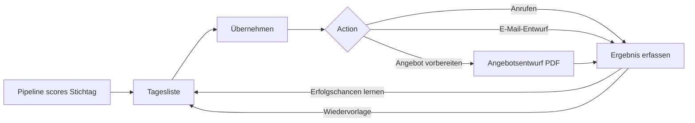
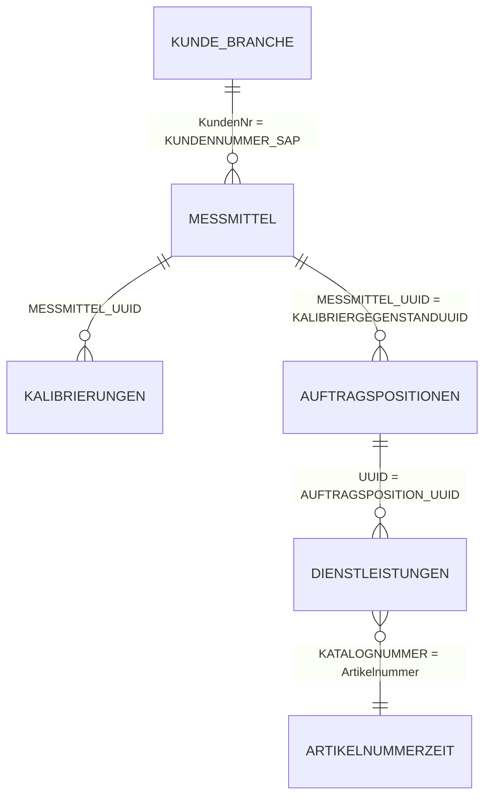
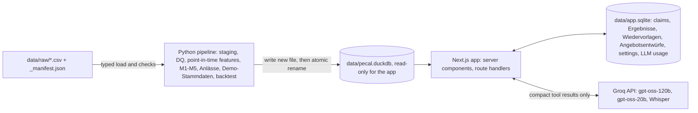

# PeCal Kompass — Product Requirements Document (Hackathon MVP)

| | |
|---|---|
| **Product** | PeCal Kompass — AI sales assistant for Perschmann Calibration's Inside Sales team (Vertriebsinnendienst) |
| **Challenge** | Hack the Lab – Perschmann KI-Hackathon, Challenge 2 "Customer Activity Monitoring" |
| **Event** | 07.–08.10.2026, Perschmann Calibration GmbH, Braunschweig |
| **Status** | Design approved · PRD v1.0 · 07.10.2026 |
| **Scope** | Hackathon MVP only (no production roadmap) |
| **Languages** | This document: English. Product UI: German by default, English via toggle |
| **Related** | [`GLOSSARY.md`](../../../GLOSSARY.md) · [ADR 0001](../../adr/0001-batch-scoring-from-csv-into-duckdb.md) · [ADR 0002](../../adr/0002-llm-narrates-never-decides.md) |

Domain terms (Kunde, Messmittel, Fälligkeit, Empfehlung, Anlass, …) are used exactly as defined in `GLOSSARY.md`. When this document and the glossary disagree, the glossary wins and this document must be fixed.

---

## Kurzfassung (für die Jury)

**PeCal Kompass** beantwortet dem Vertriebsinnendienst jeden Morgen die Frage: *„Welche Kunden sollten wir heute kontaktieren – und warum?"* Aus den vorhandenen Messmittel-, Kalibrier- und Auftragsdaten erkennt das System fällige und überfällige Messmittel, Kunden mit erhöhtem Abwanderungsrisiko, Branchenpotenzial und Portal-Chancen. Es priorisiert diese Anlässe nach erwartetem Umsatzwert, begründet jede Empfehlung in klaren Worten und erstellt auf Knopfdruck einen formalen Angebotsentwurf als PDF sowie einen E-Mail-Entwurf in der Sie-Form. Ein KI-Assistent beantwortet Fragen zu Kunden und Prognosen, aber stets auf Basis der berechneten Daten. Alle Modelle sind an echten historischen Daten gegen einfache Vergleichsverfahren validiert.

---

## 1. Summary

Perschmann's Inside Sales team spends most of its day preparing quotations, so outreach is reactive. Meanwhile customers miss their calibration due dates or quietly move instruments to another provider, and nobody notices until much later.

The data already contains two powerful signals:

1. **A near-complete schedule of future demand.** Every Messmittel carries a Fälligkeit and a Prüfintervall.
2. **A silent early-warning system.** Messmittel that should have arrived but didn't. On the reference date 25.09.2026, 64,915 Messmittel at 2,424 Kunden are Überfällig.

PeCal Kompass turns these signals into a ranked **Tagesliste** of Empfehlungen. Each Empfehlung has one **Anlass**, a plain-German **Begründung**, an **Erwarteter Wert** in € and one-click actions: Übernehmen, Anrufen, E-Mail-Entwurf, Angebot vorbereiten, Erledigt, Später.

It also attacks the root cause, quoting time. The **Angebotsentwurf** pre-fills a formal DIN 5008 quotation PDF from the Kunde's due Messmittel in seconds.

All scores come from a deterministic, validated Python pipeline over CSV snapshots. A Groq-hosted LLM writes the morning briefing, email drafts, call scripts and chat answers from those scores. It never invents them ([ADR 0002](../../adr/0002-llm-narrates-never-decides.md)).

---

## 2. Problem

### 2.1 The challenge (as given)

> **Background:** The Inside Sales team spends most of its time preparing quotations. As a result, there is little time to proactively reach out to customers. At the same time, customers may miss calibration due dates or switch to another provider. The challenge is to use available data to identify sales opportunities and customer risks at an early stage.
>
> **Challenge:** Develop an AI-powered solution that
> - predicts future calibration requirements
> - identifies customer activity and customers with an increased risk of churn
> - forecasts expected order volumes
> - prioritizes sales opportunities based on commercial potential
> - identifies sales opportunities based on industry-specific equipment portfolios (Does a customer already calibrate all relevant instruments with us, or is there untapped potential?)
>
> **Objective:** Create an intelligent sales assistant that turns existing data into concrete sales actions and provides the sales team with daily recommendations: *"Which customers should we contact today, and why?"*

### 2.2 Company context

| Fact | Detail |
|---|---|
| Company | Perschmann Calibration GmbH, Hauptstraße 46d, 38110 Braunschweig. Part of the family-owned Perschmann Gruppe (founded 1866) |
| Size | ≈ 138 employees, ≈ €10.8M revenue (2023), up to 2,000–3,000 calibrations per day |
| Accreditation | DAkkS D-K-15089-01-00, DIN EN ISO/IEC 17025:2018. More than 70 accredited and more than 100 factory (Werk) calibrations |
| Policy change | **Since 01.01.2026, DAkkS is the default Prüfungsart** when an order does not specify one |
| Customer portal | trendic® hub: more than 5,500 customers, delivery notes, Fälligkeit reminders to customers, VDI 2623 interface |
| Logistics | Loan box (€51.90 one-off), DHL pickup (€15.75 per box), regular pickup-and-delivery tour along the A2. Handling fee on orders below €200 net |
| Sales structure | Vertriebsinnendienst (central desk, +49 5307 933-200) plus 6 field-sales Gebiete |
| Systems | SAP (since 2011). No CRM identified |
| Competitors | Trescal (also in Braunschweig), Testo Industrial Services, Hoffmann Group (with Trescal), Hahn+Kolb (with MELUTEC) |
| Brand | Orange `#FF7000`, navy `#1C3B51`, Roboto, formal "Sie", motto *„schnell, einfach, auditsicher"* |

### 2.3 What the data shows

All figures were measured on the full dataset (see Appendix B). "Reference date" means Stichtag 25.09.2026.

| Finding | Evidence | Product consequence |
|---|---|---|
| The tables link together almost perfectly despite having no keys | More than 99.9% match rate across Kalibrierungen, Auftragspositionen, Dienstleistungen and Messmittel. 99% of Kunden have a Branche | A full Kunde → Messmittel → Kalibrierung → Dienstleistung graph is feasible |
| History is about 33 months, not "since 2021" | Kalibrierungen run from 22.12.2023 to 24.09.2026. Auftragspositionen start 02.01.2024 | Models are trained on 2024–2026 only. September 2026 is a partial month |
| Large overdue backlog | 64,915 Messmittel at 2,424 Kunden are Überfällig. 50,857 Messmittel at 2,233 Kunden are more than 60 days overdue (Teilabwanderung) | The "Überfällig" Anlass is the biggest lever. Recording the reason also cleans the data |
| Upcoming demand is visible | 13,747 Messmittel at 729 Kunden fall due in 30–60 days | The "Fällig demnächst" Anlass gives a proactive window |
| Customers are often late | Recalibrations relative to Fälligkeit: 55% within ±30 days, 26% 31–90 days late, 7% 91–180 days late, 5% more than 180 days late, 8% early | Rücklaufverhalten per Kunde must shift the forecast |
| Silent churn is common | 1,513 Kunden were last seen 13–24 months ago, and 1,430 of them had already dropped by more than 50% year on year | The Abwanderungsrisiko model is worth building |
| Volume is concentrated | The 2,142 Kunden active in the last 3 months produce 84% of all Kalibrierungen. The top 100 Kunden own 38% of all Messmittel | Ranking by € value, not by count |
| Portal adoption is low | Of 2,912 Kunden with orders in the last 12 months, 2,227 (76%) never ordered via trendic® hub or the API. 654 of those have 20 or more Auftragspositionen | The "Portal-Onboarding" Anlass |
| Portfolios differ by Branche | e.g. Medical: Prüfstift and Drehmomentschraubendreher are over-represented. Aerospace: Drehmomentschlüssel and Winkel | Branchenpotenzial via peer comparison |
| The 2026 mix changed | DAkkS share rose from ≈ 15% to ≈ 22%, and the n.i.O. share also rose in 2026 | The policy change must be a model feature. 2026 metrics are reported separately |
| Data gaps | 140,231 Messmittel have no Fälligkeit, 189 have a Fälligkeit beyond 2040, and Prüfintervall = 0 for 122,645. No prices, names or contacts | Data quality rules (§8.3), Demo-Stammdaten and Umsatzschätzung |

### 2.4 Problem statement

> Inside Sales cannot see which Kunden need attention today. The signals exist in the data (due dates, missing returns, shrinking volumes, unused portfolio), but they are scattered across four tables and half a million rows. The little time left after quoting goes to whoever calls first, not to where the value is.

**Insight:** the most valuable Empfehlung combines *who to call* with *getting time back*. PeCal Kompass does both: it ranks the calls and drafts the quote.

---

## 3. Goals, non-goals, success metrics

### 3.1 Goals

| ID | Goal |
|---|---|
| G1 | Every morning, answer "Welche Kunden sollten wir heute kontaktieren und warum?" in under 2 minutes |
| G2 | Cover all five challenge capabilities with data-backed, explainable results (§5) |
| G3 | Reduce the time from Empfehlung to a sendable Angebotsentwurf to under 2 minutes |
| G4 | Show on held-out data that every model beats a simple baseline |
| G5 | Feel native to German office users: language, formality, formats and Perschmann branding |

### 3.2 Non-goals (explicitly not built)

- SAP, CRM or trendic® hub integration. Demo-Stammdaten and local storage stand in for them.
- Login, roles, SSO or multi-tenancy. A simple user picker replaces them.
- Sending emails or contacting customers automatically. The product only creates drafts.
- Real prices. Only Umsatzschätzung, from Bearbeitungszeit × configurable rate.
- Live database access at runtime. CSV snapshots are the only source ([ADR 0001](../../adr/0001-batch-scoring-from-csv-into-duckdb.md)).
- Mobile apps, customer-facing features, production deployment and a post-hackathon roadmap.
- Deep learning or time-series foundation models.

### 3.3 Success metrics

| Area | Metric | Target | Measured by |
|---|---|---|---|
| Workflow | Time from opening the app to the first call decision | ≤ 2 min | Timed pitch walkthrough |
| Workflow | Time from Empfehlung to exported Angebotsentwurf (including edits) | ≤ 2 min; PDF render ≤ 3 s | Timed walkthrough, Playwright |
| Abwanderungsrisiko | Precision@100 and PR-AUC on the holdout | ≥ 1.2 × the baseline precision@100, and PR-AUC above baseline | Backtest (§8.10) |
| Auftragsvolumen | WAPE of 12 monthly totals | ≤ best of seasonal-naive and AutoETS | Backtest |
| Rücklaufverhalten | Share of returns arriving within ±1 month of the predicted month | ≥ 60% | Backtest |
| Branchenpotenzial | Adoption rate of suggested gaps within 12 months vs. random gaps | Lift ≥ 2× | Backtest |
| Assistant | Golden question set: correct tool choice and correct figures | ≥ 18 of 20 | Eval script (§9.9) |
| Accessibility | Critical axe violations on main screens | 0 | Playwright + axe |
| Reliability | Full pitch path offline (LLM mocked) | Green in 3 consecutive runs | Playwright |

If a model misses its target, the product ships the baseline for that model and says so on the Modellgüte page. Honest validation beats a fragile model.

---

## 4. Users

### 4.1 Personas

**Primary — Sabine Schneider, Vertriebsinnendienst (fictional persona)**
- Works the central sales desk: phone, email and quotes for hundreds of Kunden.
- Job to be done: *"Show me who needs me today, why, and let me act in one click."*
- Pains:
  - quoting eats the day
  - no overview of which Kunden are slipping
  - data scattered across SAP and trendic® hub
  - she doesn't want to "learn a BI tool"
- Needs:
  - a short, ranked list
  - reasons she can say on the phone
  - a ready quote draft
  - German, formal, and fast with the keyboard

**Secondary — Thomas Brandt, Vertriebsleitung (fictional persona)**
- Job to be done: *"How much volume is coming, where is revenue at risk, and is the team working the right Kunden?"*
- Needs: a 12-month Auftragsvolumen forecast, € at risk by Branche and Gebiet, team activity, and evidence that the numbers are trustworthy.

**Tertiary — Gebietsverkaufsleitung (field sales)**
- Receives handed-over Kunden ("An Außendienst übergeben") with a one-page summary.
- Does not use the product actively in the MVP.

### 4.2 Key user stories

| ID | Story | Acceptance criteria |
|---|---|---|
| US-1 | As Sabine, I open PeCal Kompass in the morning and immediately see today's Tagesliste with a short briefing | Tagesliste loads in ≤ 1.5 s. The briefing has ≤ 3 sentences. Each Empfehlung shows Kunde, Anlass, Priorität, Erwarteter Wert and the top Begründung |
| US-2 | As Sabine, I understand *why* a Kunde is on the list well enough to explain it on the phone | ≥ 2 data-backed Begründung sentences. A "Warum?" popover shows the contributing factors in plain German |
| US-3 | As Sabine, I claim a Kunde so colleagues don't call twice | "Übernehmen" marks the Empfehlung with my name for everyone, instantly |
| US-4 | As Sabine, I create a formal quote draft from the due Messmittel in under 2 minutes | One click opens a pre-filled editor. I can remove lines and switch DAkkS/Werk. Export produces a branded DIN 5008 PDF |
| US-5 | As Sabine, I get a polite German email draft | A Sie-form draft referencing the concrete Messmittel and Fälligkeiten opens in Outlook (mailto or .eml) |
| US-6 | As Sabine, I record what happened in two clicks | Ergebnis options plus optional note and Wiedervorlage. The Empfehlung leaves the list. The Ergebnis appears on Kunde-360 |
| US-7 | As Sabine, I ask the assistant questions in natural German | Answers cite figures from the data, link to Kunden and render as cards. Actions need my confirmation |
| US-8 | As Thomas, I see expected volume and € at risk | The Cockpit shows a 12-month forecast with an uncertainty band, € at risk by Branche/Gebiet, and team activity |
| US-9 | As Thomas, I can trust the numbers | The Modellgüte page shows holdout metrics vs. baselines in plain language |
| US-10 | As a jury member, I can switch the UI to English | The toggle switches all UI text. Customer documents stay German unless switched per document |

---

## 5. Challenge traceability

| Challenge requirement | How PeCal Kompass answers it | Where | Validation |
|---|---|---|---|
| Predict future calibration requirements | Fälligkeit (known or estimated) shifted by the Kunde's Rücklaufverhalten → expected arrivals per Messmittel and month (M1, M2) | Kunde-360 Fälligkeits-Zeitstrahl, Cockpit | Returns within ±1 month (§8.10) |
| Identify customer activity and churn risk | Activity profile per Kunde. Teilabwanderung per Messmittel. Abwanderungsrisiko probability with SHAP reasons (M3) | Tagesliste, Kunde-360, Cockpit | Precision@100, PR-AUC vs. recency rule |
| Forecast expected order volumes | Bottom-up Auftragsvolumen (Kalibrierungen and hours) per Kunde/month, 12 months, with uncertainty band, compared with baselines (M4) | Cockpit, Kunde-360 | WAPE vs. seasonal-naive and AutoETS |
| Prioritize by commercial potential | Erwarteter Wert = Umsatzschätzung × chance of success × urgency → Priorität (§8.7) | Tagesliste sort order | Ergebnis tracking (success chances update from outcomes) |
| Industry-specific portfolio opportunities | Branchenpotenzial: Messmittelgruppen and DAkkS share vs. Branche peers (M5) | Tagesliste Anlass, Kunde-360 Lückenmatrix | Adoption lift vs. random |
| Daily "who and why" | Tagesliste plus Morgen-Briefing plus Begründung plus one-click actions | Heute | Timed walkthrough ≤ 2 min |

---

## 6. Product overview

### 6.1 Concept

PeCal Kompass is a **workspace, not a dashboard**. The home screen is a triage list, like a modern email client (Superhuman or Linear style): a ranked list on the left and the selected Kunde on the right. Every action is one click or one keystroke away. There is no wall of KPI tiles.

### 6.2 Screens

| Screen | Route | Primary user | Purpose |
|---|---|---|---|
| **Heute** | `/` | Inside Sales | Tagesliste, Morgen-Briefing, actions |
| **Kunde-360** | `/kunden/[kundeId]` | Inside Sales | Full context of one Kunde |
| **Kunden** | `/kunden` | Both | Search and filter all Kunden |
| **Angebotsentwurf** | `/angebote/[id]` | Inside Sales | Edit and export the quote PDF |
| **Cockpit** | `/cockpit` | Vertriebsleitung | Forecast, € at risk, team activity |
| **Modellgüte** | `/modellguete` | Both and the jury | Validation results in plain language |
| **Einstellungen** | `/einstellungen` | Both | Stichtag, Stundensatz, success chances, capacity, thresholds, LLM usage |
| **PeCal-Assistent** | Drawer, everywhere (`⌘J`) | Both | Chat with generative UI |
| **Command palette** | Overlay, everywhere (`⌘K`) | Both | Jump to a Kunde or screen, run actions |

### 6.3 Core loop



---

## 7. Functional requirements

Priority: **M** = Must (Phase 1), **S** = Should (Phase 2 if listed as core in §17.2, otherwise deferred per §17.3), **X** = Stretch (deferred).

### 7.1 Global shell

| ID | Requirement | Prio | Acceptance criteria |
|---|---|---|---|
| FR-G1 | **User picker.** Seeded users: 3 Inside Sales reps (Sabine Schneider, Murat Yılmaz, Julia Wagner) and 1 Vertriebsleitung (Thomas Brandt). No password | M | The selection persists in a cookie. The header shows name and role. Vertriebsleitung sees Cockpit first |
| FR-G2 | **Language toggle DE/EN.** German by default | M | Every UI string comes from message catalogues. No hard-coded text. The choice persists |
| FR-G3 | **Stichtag indicator** in the header, e.g. "Stichtag: Fr., 25.09.2026 · KW 39" | M | Always visible. Matches pipeline metadata |
| FR-G4 | **Demo-Daten badge** wherever Demo-Stammdaten are shown | M | Badge with tooltip "Fiktive Stammdaten für die Demo" |
| FR-G5 | **Command palette** (`⌘K` / `Strg+K`): search Kunden by number or demo name, jump to screens, run "Angebot für …", "Stichtag …" | S | Fuzzy search ≤ 100 ms on all Kunden |
| FR-G6 | **Keyboard shortcuts:** `J/K` move, `Enter` open, `Ü` claim, `E` email, `A` quote, `D` done, `S` snooze, `?` help overlay | S | Shortcuts are shown in tooltips and in the help overlay |
| FR-G7 | **Assistant drawer** (`⌘J`) on every screen, aware of the current Kunde | M | Opening on Kunde-360 pre-fills the context "Kunde 10132" |

### 7.2 Heute — Tagesliste

| ID | Requirement | Prio | Acceptance criteria |
|---|---|---|---|
| FR-H1 | Show the Tagesliste for the Stichtag, sorted by Erwarteter Wert, with length = Σ rep capacity (default 3 × 20) | M | Order is deterministic for the same data and settings |
| FR-H2 | Each row shows: demo name and Kundennummer, Branche, Gebiet, Anlass chip, secondary Anlass tags, Priorität badge (Hoch/Mittel/Niedrig), Erwarteter Wert (e.g. "≈ 3.780 €"), top Begründung sentence, claim status | M | No raw model scores in the list |
| FR-H3 | Filters: Anlass, Priorität, Branche, Gebiet, "Nur meine", "Nicht übernommen". The filter state lives in the URL | M | Filters combine with AND. The count updates live |
| FR-H4 | Split view: selecting a row opens the detail pane (§7.3) without a page change | M | Detail renders ≤ 300 ms after selection |
| FR-H5 | **Morgen-Briefing** above the list (§7.9) | S | ≤ 3 sentences. Falls back to a template if the LLM is unavailable |
| FR-H6 | Progress indicator "12 von 20 erledigt" per rep. Completed rows animate out | S | Respects `prefers-reduced-motion` |
| FR-H7 | Empty state: "Alles erledigt für heute. Morgen geht's weiter." with a link to Wiedervorlagen | S | — |

### 7.3 Empfehlung detail pane

| ID | Requirement | Prio | Acceptance criteria |
|---|---|---|---|
| FR-E1 | Header: Kunde, Anlass, Priorität, Erwarteter Wert, affected Messmittel count | M | — |
| FR-E2 | **Begründung:** 2–4 sentences rendered from structured reason codes (§8.9) in the UI language | M | Every number in a sentence can be traced to a pipeline output |
| FR-E3 | **"Warum?" popover:** contributing factors as a horizontal bar list in plain words (from SHAP for Abwanderungsrisiko, rule facts for the other Anlässe) | M | ≤ 6 factors, sorted by impact |
| FR-E4 | Mini Fälligkeits-Zeitstrahl (§10.4) of the affected Messmittel | S | — |
| FR-E5 | Affected Messmittel table (group, type, size, Ident-Nr., Fälligkeit, status) with "Alle anzeigen" → Kunde-360 | M | Virtualised for more than 100 rows |
| FR-E6 | Demo contact block: Ansprechpartner, Telefon (`tel:` link), E-Mail, Ort, Gebiet | M | Demo-Daten badge |
| FR-E7 | Action bar: **Übernehmen**, **Anrufen**, **E-Mail-Entwurf**, **Angebot vorbereiten**, **Erledigt**, **Später**, **An Außendienst übergeben** | M | Each action ≤ 2 clicks. Optimistic UI with undo toast (5 s). "An Außendienst übergeben" records that Ergebnis directly (the PDF summary FR-A7 is deferred) |

### 7.4 Actions, Ergebnis, Wiedervorlage

| ID | Requirement | Prio | Acceptance criteria |
|---|---|---|---|
| FR-A1 | **Übernehmen** stores the claim (user, time). Other users see "Übernommen von S. Schneider" | M | A claimed Empfehlung cannot be claimed twice. Claims are scoped to the Stichtag. Switching to another Stichtag shows that Stichtag's claims |
| FR-A2 | **Erledigt** opens the Ergebnis dialog with options: *Angebot erstellt · Auftrag zugesagt · Kein Bedarf · Wettbewerber · Messmittel ausgemustert · Falscher Ansprechpartner · Nicht erreicht · An Außendienst übergeben*, plus an optional note and optional Wiedervorlage date | M | Two clicks for the common case. The Ergebnis is stored with Anlass and Empfehlung reference |
| FR-A3 | Choosing *Wettbewerber* asks optionally which one: Trescal · Testo Industrial Services · Hoffmann Group · Hahn+Kolb · Andere · Unbekannt | S | Shown in the Kunde-360 contact timeline (the Cockpit chart belongs to the deferred FR-L4) |
| FR-A4 | **Später** sets a Wiedervorlage (presets: morgen, nächste Woche, in 4 Wochen, Datum wählen) | M | The Kunde is hidden until the date, then reappears with a "Wiedervorlage" tag |
| FR-A5 | Kunden with an Ergebnis in the last 14 days are excluded from the Tagesliste (cooldown, configurable) | M | — |
| FR-A6 | Exporting an Angebotsentwurf automatically records Ergebnis *Angebot erstellt* (editable) | M | — |
| FR-A7 | **An Außendienst übergeben** creates a one-page PDF summary for the Gebiet and records the Ergebnis | S | — |
| FR-A8 | Ergebnisse feed the success chances per Anlass (§8.7) | S | The Einstellungen page shows the prior and the learned value per Anlass |

### 7.5 Kunde-360

| ID | Requirement | Prio | Acceptance criteria |
|---|---|---|---|
| FR-K0 | **Kunden list** (`/kunden`): search by Kundennummer or demo name. Filters: Branche, Gebiet, Anlass, risk band, Bestellkanal. Sort by Umsatzschätzung, Abwanderungsrisiko, Überfällig count | S | Virtualised over all ≈ 6,500 Kunden with Messmittel. Filter state lives in the URL |
| FR-K1 | Header: demo name, Kundennummer, Branche, Gebiet, Bestellkanal mix (Portal/Intern/API), Kunde since, active Messmittel, Abwanderungsrisiko gauge with band (niedrig/mittel/hoch) | M | Loads ≤ 1 s for Kunden with up to 10,000 Messmittel |
| FR-K2 | **Fälligkeits-Zeitstrahl:** 6 months back to 12 months ahead. Überfällig on the left, upcoming due counts per month, expected arrivals overlaid | M | Hover shows counts per Messmittelgruppe |
| FR-K3 | **Activity history:** Kalibrierungen per month (24 months), DAkkS share, n.i.O. share, Bestellkanal share, compared with the Branche median | M | — |
| FR-K4 | **Portfolio-Lückenmatrix:** Messmittelgruppen × (this Kunde vs. Branche peers). Gaps highlighted with Umsatzschätzung | M | Gaps match the Branchenpotenzial output |
| FR-K5 | **Messmittel table:** all Messmittel with filters (status, group, Prüfungsart), sort and search; columns Ident-Nr., group/type/size, letzte Kalibrierung, Bewertung, Fälligkeit (with "geschätzt" marker), status | M | Virtualised. Export to CSV |
| FR-K6 | **Auftragsvolumen forecast:** 12 months of Kalibrierungen and hours with an uncertainty band | S | — |
| FR-K7 | **Contact timeline:** past Ergebnisse, Angebotsentwürfe, Wiedervorlagen | M | — |
| FR-K8 | All actions from FR-E7 are available here too | M | — |

### 7.6 Angebotsentwurf

| ID | Requirement | Prio | Acceptance criteria |
|---|---|---|---|
| FR-Q1 | "Angebot vorbereiten" creates a draft pre-filled with the Kunde's Messmittel that are Überfällig or due in the next 60 days (configurable), excluding n.i.O. and stopped ones | M | Draft created ≤ 1 s |
| FR-Q2 | Editor: lines grouped by Dienstleistung (Katalognummer + Prüfungsart) with quantity × unit price. Each line expands to its Messmittel. The rep can remove Messmittel and switch DAkkS ↔ Werk per line or for all lines | M | Totals update live |
| FR-Q3 | Unit price = Bearbeitungszeit (min) ÷ 60 × Stundensatz (default 90 €/h), rounded to 0.10 €. Marked "Richtpreis (Schätzung)" | M | — |
| FR-Q4 | Optional logistics lines: Leihbox (51,90 €), DHL-Abholung (15,75 € je Box), Hol- und Bringservice (on request) | S | — |
| FR-Q5 | PDF export per §11 (DIN 5008 Form B, branded, watermark) | M | Render ≤ 3 s for up to 500 Messmittel. Annex lists every Messmittel |
| FR-Q6 | Draft number format `AE-2026-000123`, sequential per installation | M | — |
| FR-Q7 | Document language German by default, English per document | S | — |

### 7.7 E-Mail-Entwurf and Gesprächsleitfaden

| ID | Requirement | Prio | Acceptance criteria |
|---|---|---|---|
| FR-M1 | E-Mail-Entwurf per Anlass: subject plus body in German Sie-form, with concrete Messmittel counts, Fälligkeiten (with KW) and the offer (Abholung, Angebot, trendic® hub) | M | The template version works without the LLM. The LLM version personalises the tone |
| FR-M2 | Open as an Outlook draft: `mailto:` for short bodies, `.eml` download for long bodies or attachments (quote PDF) | M | Umlauts render correctly (UTF-8) |
| FR-M3 | **Gesprächsleitfaden:** opener, Anlass, value points (auditsicher, Hol- und Bringservice, trendic® hub), 3 objection handlers, close | S | ≤ 150 words, readable during a call |
| FR-M4 | Copy-to-clipboard for both | M | — |

### 7.8 PeCal-Assistent (chatbot)

| ID | Requirement | Prio | Acceptance criteria |
|---|---|---|---|
| FR-C1 | Drawer chat with streaming answers in the UI language | M | First token ≤ 1.5 s (Groq) |
| FR-C2 | Answers only from tool results (§9.3). Never states a figure that no tool returned | M | Golden set (§9.9) |
| FR-C3 | **Generative UI:** tool results render as interactive components (KundenKarte, Messmittel-Mini-Tabelle, Prognose-Sparkline, Empfehlungs-Karte) with action buttons | M | Buttons work the same as in the main UI |
| FR-C4 | Context-aware: knows the current screen and selected Kunde | M | — |
| FR-C5 | Actions (create an E-Mail-Entwurf or Angebotsentwurf, set a Wiedervorlage) require explicit confirmation in the chat | M | Nothing is written without a click |
| FR-C6 | Suggested prompts on open, e.g. *„Wen sollte ich heute zuerst anrufen?"*, *„Warum steht Kunde 10132 auf der Liste?"*, *„Welche Automotive-Kunden im Gebiet Süd haben nächsten Monat mehr als 30 fällige Messmittel?"*, *„Wie viel Volumen erwarten wir im Dezember?"* | M | — |
| FR-C7 | Graceful degradation on 429/timeout: *„Der Assistent ist gerade ausgelastet – bitte in einer Minute erneut versuchen."*. The rest of the app is unaffected | M | — |
| FR-C8 | Voice input via Whisper (see §7.14) | X | — |

### 7.9 Morgen-Briefing

| ID | Requirement | Prio | Acceptance criteria |
|---|---|---|---|
| FR-B1 | One LLM call per user and Stichtag, cached. Input: the user's top Empfehlungen and team counts. Output ≤ 3 sentences | S | Example: *„Guten Morgen, Frau Schneider. Für heute liegen 20 Empfehlungen vor, 6 davon mit hoher Priorität. Größter Hebel: Müller Präzisionstechnik GmbH mit 42 überfälligen Messmitteln (≈ 3.780 €)."* |
| FR-B2 | Template fallback with the same structure | S | — |

### 7.10 Cockpit (Vertriebsleitung)

| ID | Requirement | Prio | Acceptance criteria |
|---|---|---|---|
| FR-L1 | KPI strip (max 4): expected Kalibrierungen next 3 months, Umsatzschätzung next 12 months, € at risk (Σ Abwanderungsrisiko × Umsatzschätzung), Überfällig Messmittel | M | Each KPI has a one-line explanation |
| FR-L2 | **Forecast chart:** monthly Kalibrierungen and hours, 24 months history plus 12 months forecast with an uncertainty band, baseline toggle | M | — |
| FR-L3 | € at risk by Branche and by Gebiet (sorted bars). Click → filtered Kunden list | M | The bars are Phase 1. The click-through works once FR-K0 exists (Phase 2) |
| FR-L4 | Team activity: Empfehlungen claimed/done per rep, Ergebnis distribution, success rate per Anlass, Verlustgründe | S | — |
| FR-L5 | Kapazitätsabgleich (§7.15) | X | — |

### 7.11 Modellgüte

| ID | Requirement | Prio | Acceptance criteria |
|---|---|---|---|
| FR-V1 | One card per model (M1–M5): what it does (1 sentence), holdout metric vs. baseline, "Was bedeutet das?" in plain German | M | Values come from pipeline output tables, never hard-coded |
| FR-V2 | Charts: Abwanderungsrisiko calibration plot and precision@k curve, forecast vs. actual for the holdout year, return-timing histogram | M | — |
| FR-V3 | 2026 results shown separately (DAkkS default policy) | S | — |
| FR-V4 | "Annahmen" panel: Stundensatz, success chances, thresholds, with source and status (assumed/learned) | M | — |

### 7.12 Einstellungen

| ID | Requirement | Prio | Acceptance criteria |
|---|---|---|---|
| FR-S1 | Stundensatz (default 90 €/h) | M | The Tagesliste and quotes recompute instantly (no pipeline run) |
| FR-S2 | Success chance per Anlass (prior) and learned value | M | — |
| FR-S3 | Capacity per rep (default 20), cooldown (14 days), Fällig window (30–60 days), Überfällig window (15 days to 18 months), risk threshold (0.5) | S | Thresholds the pipeline needs are labelled "wirkt ab nächstem Pipeline-Lauf" (applies from the next pipeline run) |
| FR-S4 | Available Stichtage (those the pipeline has built) and the current one | M | — |
| FR-S5 | LLM usage meter: requests and tokens today vs. free-tier limits, per model | S | — |

### 7.13 Pitch-Modus and Rückblick

| ID | Requirement | Prio | Acceptance criteria |
|---|---|---|---|
| FR-P1 | **Pitch-Modus** toggle: fixed Stichtag 25.09.2026, seeded state (a few claims and Ergebnisse), resettable with one click | M | Reset restores the identical state |
| FR-P2 | **Rückblick** (time travel): switch to a past Stichtag (25.03.2026). Each Empfehlung shows what actually happened afterwards (e.g. "Kunde hat 3 von 42 Messmitteln eingeschickt", "Keine Kalibrierung seit Empfehlung") | S | Uses the same pipeline output and backtest data |
| FR-P3 | Guided hints (optional coach marks) for the 5 pitch steps (§16.2) | X | — |

### 7.14 Sprachnotiz (Stretch)

| ID | Requirement | Prio | Acceptance criteria |
|---|---|---|---|
| FR-X1 | In the Ergebnis dialog, "Sprachnotiz" records audio. Whisper (`whisper-large-v3-turbo`, German) transcribes it. The LLM extracts Ergebnis code, note and Wiedervorlage date as JSON. The user confirms | X | ≤ 5 s round trip for a 20 s note. Never saved without confirmation |

### 7.15 Kapazitätsabgleich (Stretch)

| ID | Requirement | Prio | Acceptance criteria |
|---|---|---|---|
| FR-X2 | Forecast hours per Messraum (MR1–MR14) vs. projected Soll capacity. `Soll-Kapa` only covers 01/2024–08/2026, so the projection uses same-month-prior-year capacity | X | Months above 100% are flagged |
| FR-X3 | Hint on Empfehlungen: *„Vorziehen möglich: MR7 im Dezember nur zu 64 % ausgelastet"* when pulling a due date forward fills a capacity valley | X | — |

---

## 8. Intelligence layer

### 8.1 Data sources and contract

- **Source of truth:** full CSV snapshots in `data/raw/` (git-ignored), one file per table plus `_manifest.json`.
- **Format:** UTF-8, comma-separated, RFC 4180 quoting, header = original column names, NULL = empty, timestamps `YYYY-MM-DD HH:MM:SS.fff`, bit = `0/1`, decimal point `.`.
- **Load rules (must):**
  1. Read every CSV with an **explicit schema**. All ID-like columns (`*_UUID`, `*NUMMER*`, `KundenNr`, `Artikelnummer`, `KATALOGNUMMER`) are read as **text**. Auto-detection would silently turn `SAPNUMMER` or `IDENTNUMMER` into integers and drop leading zeros.
  2. Check row counts against `_manifest.json`. **Abort** on mismatch.
  3. Normalise UUIDs to lowercase (≈ 22,000 per table are uppercase) and trim all IDs.
- **Refresh (optional):** `tools/export_mssql_to_csv.py` re-exports all tables through the read-only MSSQL account. It reads credentials from `.env` and writes data plus manifest. The product never connects to MSSQL.

| Table | Rows | Used for |
|---|---|---|
| `MESSMITTEL` | 488,699 | Current Messmittel state, Fälligkeit, group/type, Kunde |
| `KALIBRIERUNGEN` | 662,287 | Calibration history (12/2023–09/2026), Prüfungsart, Bewertung, interval at the time |
| `AUFTRAGSPOSITIONEN` | 536,573 | Orders (01/2024–09/2026), Bestellkanal, add-on flags |
| `DIENSTLEISTUNGEN` | 789,616 | Services, Katalognummer, status (ERBRACHT / HINZUGEFUEGT / ABGESAGT) |
| `ArtikelnummerZeit` | 1,759 | Bearbeitungszeit (min) per Katalognummer |
| `Kunde_Branche` | 15,468 | Branche per Kunde |
| `Soll-Kapa`, `Ist_Stunden_24-26` | 10,358 / 10,617 | Capacity per Messraum (stretch only) |

### 8.2 Join model



Measured coverage: Kalibrierungen→Messmittel 662,280/662,287. Auftragspositionen→Messmittel 536,559/536,573. Dienstleistungen→Auftragspositionen 100%. Dienstleistungen→ArtikelnummerZeit 747,092/789,616 (94.6%). Messmittel Kunden with a Branche: 6,466/6,525.

### 8.3 Data quality rules

| ID | Rule | Affected |
|---|---|---|
| DQ-1 | Fälligkeit after 31.12.2040 → treated as missing (implausible, e.g. year 2608) | 189 Messmittel |
| DQ-2 | Prüfintervall unit codes: `1` = Jahre, `2` = Monate, `3` = Wochen, `4` = Tage (verified against date differences). Normalised to months | all |
| DQ-3 | Prüfintervall = 0 or missing → unknown. Imputed with the median interval of the Messmitteltyp (fallback: Messmittelgruppe, then 12 months). If the Fälligkeit is missing, it is derived from the last Kalibrierung + interval and flagged **„Fälligkeit geschätzt"** | 122,645 with Prüfintervall 0; 140,231 without Fälligkeit (overlapping) |
| DQ-4 | `FAELLIGKEIT_STOP = 1` → excluded from all due logic | 159 |
| DQ-5 | Letzte Bewertung = NICHT_EINSATZFAEHIG → excluded from Fällig/Überfällig counts (likely replaced) but counted in the n.i.O. share | 27,833 |
| DQ-6 | `MESSRAUM` in {`-`, empty, `Extern`} → "Unbekannt" | 66 |
| DQ-7 | Kunden without a Branche row → Branche "Ohne Zuordnung", excluded from peer statistics | 59 Kunden |
| DQ-8 | Kunden in Branche "Sonstiges" (42% of all Kunden) get **no** Branchenpotenzial (no meaningful peer group) | 6,457 Kunden |
| DQ-9 | Partial month: data ends 24.09.2026. Monthly features and backtests treat 09/2026 as partial (scaled or excluded, consistently) | — |
| DQ-10 | Kundennummer kept as text (non-numeric values like `PE2200` exist) | — |
| DQ-11 | Dienstleistungen with status ABGESAGT are excluded from volume but used as a feature (cancellation share) | 14,031 |
| DQ-12 | Every rule writes a counter to `dq_report` and is shown in Modellgüte → Datenqualität | — |

### 8.4 Point-in-time reconstruction (no leakage)

`MESSMITTEL` holds only the *current* state. For any past date *t* (training snapshots, backtests, Rückblick), the pipeline reconstructs each Messmittel's state as of *t*:

- **Fälligkeit as of t:**
  - If the Messmittel has a Kalibrierung before *t*: the last Kalibrierung before *t* + its Prüfintervall (from `KALIBRIERUNGEN`).
  - Otherwise, if `DATUM_LETZTE_PRUEFUNG` < 2024-01-01: the current `DATUM_NAECHSTE_PRUEFUNG`. It hasn't changed since.
  - Otherwise: unknown at *t*.
- **Existence as of t:** the first sighting (first Kalibrierung or Auftragsposition) must be ≤ *t*.
- **Features** only use events with timestamp ≤ *t*. **Labels** only use events in (*t*, *t* + horizon].
- A unit test asserts that shifting all events after *t* leaves the features unchanged.

### 8.5 Models

#### M1 — Rücklaufverhalten (return behaviour)
- **Observation:** for each consecutive pair of Kalibrierungen of a Messmittel: lag = date of the next Kalibrierung − (previous Kalibrierung + Prüfintervall), in days.
- **Per-Kunde estimate:** median lag and *Rücklaufquote* = share of due Messmittel that returned within 180 days of Fälligkeit.
- **Shrinkage (empirical Bayes):** estimate_K = (n·x̄_K + k·x̄_Branche) / (n + k) with k = 20, so Kunden with little history borrow from their Branche, and the Branche from the global value.
- **Output:** `ruecklauf(kunde_id, median_lag_tage, ruecklaufquote, n_beobachtungen)`.

#### M2 — Fälligkeitsprognose (future calibration requirements)
- For each active Messmittel: next Fälligkeit (known or imputed per DQ-3) → **expected arrival month** = Fälligkeit + Kunde median lag. **Arrival probability** = Kunde Rücklaufquote, × 0.3 if the Messmittel is already more than 12 months overdue.
- **New Messmittel term:** per Kunde, the average monthly count of first-time Kalibrierungen (Erstkalibrierung) over the last 12 months, carried forward.
- **Output:** `erwarteter_eingang(messmittel_id, monat, p)`.

#### M3 — Abwanderungsrisiko (churn risk)
- **Unit:** Kunde × monthly snapshot *t*, for Kunden with ≥ 5 Kalibrierungen expected in (*t*, *t* + 6 months]. Others show "Zu wenig Daten für eine Risikobewertung".
- **Label:** 1 if actual Kalibrierungen in (*t*, *t* + 6 months] < 0.5 × expected Kalibrierungen (from Fälligkeiten as of *t*).
- **Features (as of t):**
  - Recency: days since the last Kalibrierung and since the last Auftragsposition.
  - Frequency and trend: Kalibrierungen in the last 3, 6 and 12 months; ratio of the last 6 months to the prior 6.
  - Due status: overdue share, Teilabwanderung count, Rücklaufverhalten (M1 as of *t*).
  - Quality and mix: n.i.O. share, DAkkS share, add-on share (Signierung, Schmelztauchen), ABGESAGT share.
  - Channel: Bestellkanal share (Portal/Intern/API) and its 6-month change.
  - Profile: active Messmittel, portfolio breadth (number of groups), Branche (categorical), months as Kunde.
  - Policy: `nach_dakks_default` = *t* ≥ 2026-01-01.
- **Model:** LightGBM binary classifier (monotone constraint: higher recency → higher risk), class weights for imbalance. Probabilities calibrated with isotonic regression on the last 3 training snapshots.
- **Explanations:** TreeSHAP per Kunde. The top 3 positive contributors are mapped to reason codes (§8.9).
- **Baseline:** rule "≥ 6 Monate keine Kalibrierung" ranked by days since the last Kalibrierung.
- **Fallback:** if the model doesn't beat the baseline (§3.3), the product uses the baseline score and labels it as such.
- **Output:** `risiko(kunde_id, p_abwanderung, band, top_faktoren[])`, with band niedrig < 0.3 ≤ mittel < 0.5 ≤ hoch.

#### M4 — Auftragsvolumen (order volume forecast)
- **Bottom-up:** Σ over Messmittel of the M2 arrival probability per month, plus the new-Messmittel term → Kalibrierungen per Kunde per month for 12 months. Hours = × Bearbeitungszeit of the Messmittel's last Katalognummer (fallback: Messmitteltyp median, then Messmittelgruppe median), using the Prüfungsart mix of the last 6 months.
- **Uncertainty band:** variance = Σ p(1 − p) per month (Poisson-binomial). 80% band via a normal approximation, widened by the empirical holdout error.
- **Baselines** on monthly totals: seasonal-naive (same month last year) and AutoETS (`statsforecast`).
- **Output:** `prognose_monat(ebene ∈ {gesamt, kunde, branche, gebiet, messraum}, schluessel, monat, kalibrierungen, stunden, p10, p90, methode)`.

#### M5 — Branchenpotenzial (industry portfolio gaps)
- **Peer set:** active Kunden (Kalibrierung in the last 12 months) of the same Branche with ≥ 20 Messmittel, excluding "Sonstiges" and "Ohne Zuordnung".
- **Group penetration** per Branche b and Messmittelgruppe g = share of peers with ≥ 1 active Messmittel in g.
- **Group gap:** penetration ≥ 40% and the Kunde has 0 Messmittel in g. Expected count = Kunde active Messmittel × median share of g among peers that own g. Value = expected count × median Bearbeitungszeit of g × Stundensatz.
- **DAkkS gap:** for Branchen with audit pressure (Luft- & Raumfahrt, Medical, Automotive, Defence, Pharma), the Kunde's DAkkS share is ≥ 20 percentage points below the peer median. Value = affected Messmittel × (DAkkS − Werk Bearbeitungszeit difference of the group) × Stundensatz.
- **Output:** `potenzial(kunde_id, typ ∈ {gruppe, dakks}, messmittelgruppe, peer_anteil, erwartete_anzahl, stunden, begruendung_codes[])`.

### 8.6 Anlass rules

Evaluated per Kunde on the Stichtag. A Kunde can qualify for several Anlässe. The one with the highest Erwarteter Wert becomes primary, and the others are shown as tags. "Hours" per Messmittel always means the Bearbeitungszeit resolution defined in M4 (last Katalognummer, then Messmitteltyp median, then Messmittelgruppe median).

| Anlass | Condition (all configurable) | Affected Messmittel | Value basis |
|---|---|---|---|
| **Fällig demnächst** | ≥ 1 active Messmittel with Fälligkeit in [Stichtag + 30, Stichtag + 60] days and no Auftragsposition since its last Kalibrierung | Those Messmittel | Σ hours × Stundensatz |
| **Überfällig** | ≥ 1 active Messmittel with Fälligkeit in [Stichtag − 18 months, Stichtag − 15 days] and no Auftragsposition since its last Kalibrierung | Those Messmittel. Teilabwanderung = more than 60 days overdue (badge) | Σ hours × Stundensatz |
| **Abwanderungsrisiko** | p_abwanderung ≥ 0.5 | All active Messmittel | Umsatzschätzung next 12 months (M4) |
| **Branchenpotenzial** | ≥ 1 group gap or DAkkS gap (M5) | Expected Messmittel | Σ potential hours × Stundensatz |
| **Portal-Onboarding** | ≥ 20 Auftragspositionen in the last 12 months **and** (0 via Portal/API **or** Portal share at least halved vs. the prior 12 months) | — | Umsatzschätzung next 12 months × 5% retention effect (assumption A-5) |

### 8.7 Erwarteter Wert and Priorität

```
Erwarteter Wert (EV) = Umsatzschätzung_betroffen  ×  Erfolgschance(Anlass)  ×  Dringlichkeit
Umsatzschätzung      = Bearbeitungsstunden × Stundensatz
```

| Anlass | Erfolgschance prior | Dringlichkeit |
|---|---|---|
| Fällig demnächst | 0.60 | 1.0 |
| Überfällig | 0.35 | exp(−Tage überfällig / 180) |
| Abwanderungsrisiko | 0.25 | p_abwanderung |
| Branchenpotenzial | 0.15 | peer_anteil |
| Portal-Onboarding | 0.30 | 1.0 |

- **Learning from Ergebnisse (Beta-Binomial):** Erfolgschance = (α₀ + Erfolge) / (α₀ + β₀ + Versuche), with α₀ = prior × 10 and β₀ = (1 − prior) × 10. Erfolg = Ergebnis ∈ {Angebot erstellt, Auftrag zugesagt}. Versuche = all Ergebnisse except the neutral ones, "Nicht erreicht" and "An Außendienst übergeben".
- **Computed in the app at query time:** the pipeline outputs `stunden_betroffen` and `dringlichkeit`, and the app multiplies by Stundensatz and Erfolgschance. Changing these settings needs no pipeline run.
- **Priorität bands** over all candidate Empfehlungen of the Stichtag: top 20% EV = **Hoch**, next 30% = **Mittel**, rest = **Niedrig**.
- The Stundensatz scales every EV equally. **Changing it never changes the ranking**, only the displayed € amounts and quote prices.

### 8.8 Tagesliste assembly

**Working date = Stichtag.** Every claim, Ergebnis and Wiedervorlage is stored with the Stichtag under which it was recorded, plus the real timestamp for audit. Cooldown, "done today" and Wiedervorlage checks compare against the Stichtag, never against the wall clock. This keeps Pitch-Modus and Rückblick consistent even though the demo runs on 07./08.10.2026 against data from 25.09.2026.

1. Take all candidate Empfehlungen for the Stichtag (one per Kunde, primary Anlass by EV).
2. Remove Kunden with an Ergebnis in the last 14 days (cooldown), with a future Wiedervorlage, or already done today.
3. Add back Kunden whose Wiedervorlage is today, tagged "Wiedervorlage".
4. Sort by EV descending. Take the top N, where N = Σ rep capacity.
5. Ties are broken by Kundennummer, so the order is deterministic.

### 8.9 Begründung (structured reason codes)

The pipeline never writes prose. It writes **reason codes with parameters**, and the app renders them through DE/EN message templates. This keeps explanations instant, free, translatable and testable.

| Code | Parameters | German template (EN analogous) |
|---|---|---|
| `UEBERFAELLIG` | n, tage_median | „{n} Messmittel sind seit durchschnittlich {tage_median} Tagen überfällig." |
| `TEILABWANDERUNG` | n | „{n} davon seit über 60 Tagen – vermutlich anderswo kalibriert oder ausgemustert." |
| `FAELLIG_BALD` | n, kw_von, kw_bis | „{n} Messmittel werden zwischen KW {kw_von} und KW {kw_bis} fällig." |
| `RECENCY` | monate, ueblich_monate | „Letzte Kalibrierung vor {monate} Monaten – üblich sind {ueblich_monate}." |
| `TREND_RUECKGANG` | prozent | „Kalibriervolumen der letzten 6 Monate {prozent} % unter dem Vorhalbjahr." |
| `SPAET_RUECKLAUF` | tage | „Sendet Messmittel typischerweise {tage} Tage nach Fälligkeit." |
| `BRANCHE_LUECKE` | gruppe, peer_prozent | „{peer_prozent} % vergleichbarer Kunden lassen {gruppe} bei uns kalibrieren – dieser Kunde nicht." |
| `DAKKS_LUECKE` | kunde_prozent, peer_prozent | „DAkkS-Anteil {kunde_prozent} % – Branchenüblich sind {peer_prozent} %." |
| `KANAL_PORTAL_NIE` | n | „{n} Aufträge im letzten Jahr, keiner über trendic® hub." |
| `KANAL_PORTAL_RUECKGANG` | prozent | „Portal-Anteil um {prozent} % gesunken." |
| `NIO_ANSTIEG` | prozent | „n.i.O.-Quote auf {prozent} % gestiegen – Beratungsbedarf?" |
| `STORNO` | n | „{n} abgesagte Dienstleistungen in 12 Monaten." |

SHAP features of M3 map to codes through a fixed table, e.g. `tage_seit_letzter_kal` → `RECENCY`, `trend_6m` → `TREND_RUECKGANG`.

### 8.10 Validation protocol

- **Time split:** training labels must end by 30.09.2025. Test snapshots run from 10/2025 to 03/2026, with label windows up to 09/2026. The production model is retrained on all snapshots up to 03/2026 for scoring on 25.09.2026.

| Model | Metric(s) | Baseline | Target |
|---|---|---|---|
| M1/M2 | % of actual returns within ±1 month of the predicted month | Fälligkeit without lag | ≥ 60% and better than baseline |
| M3 | PR-AUC, precision@100, Brier score, calibration curve | Recency rule | precision@100 ≥ 1.2 × baseline |
| M4 | WAPE of 12 monthly totals (origin 09/2025), 12-month total error, WAPE for the top 500 Kunden | Seasonal-naive, AutoETS | ≤ best baseline |
| M5 | Share of gaps (from Stichtag 25.09.2025) that the Kunde filled within 12 months | Random group of the same Branche | Lift ≥ 2× |
| Ranking | Rückblick: for Empfehlungen at 25.03.2026, share of Kunden whose volume afterwards fell below expectations, compared by Priorität band | — | Monotone across Hoch > Mittel > Niedrig |

All metrics are written to `modellguete` together with the run timestamp and data manifest hash.

### 8.11 Pipeline outputs (DuckDB contract read by the app)

| Table | Key | Main columns |
|---|---|---|
| `meta` | — | stichtag, built_at, manifest_hash, pipeline_version, verfuegbare_stichtage |
| `kunde` | kunde_id | branche, gebiet, demo_name, demo_ansprechpartner, demo_telefon, demo_email, demo_ort, aktive_messmittel, kunde_seit, kanal_anteile, letzte_kalibrierung, umsatzschaetzung_12m_stunden |
| `messmittel` | messmittel_id | kunde_id, gruppe, typ, groesse, bezeichnung, ident_nr, letzte_kalibrierung, letzte_bewertung, pruefungsart, faelligkeit, faelligkeit_geschaetzt, status (ok, faellig_bald, ueberfaellig, teilabwanderung, gestoppt, nio), katalognummer, bearbeitungszeit_min, messraum |
| `kalibrierung_monat` | kunde_id, monat | anzahl, dakks_anzahl, nio_anzahl, stunden |
| `ruecklauf` | kunde_id | median_lag_tage, ruecklaufquote, n |
| `risiko` | kunde_id, stichtag | p_abwanderung, band, top_faktoren (JSON reason codes) |
| `prognose_monat` | ebene, schluessel, monat, methode | kalibrierungen, stunden, p10, p90 |
| `potenzial` | kunde_id, typ, messmittelgruppe | peer_anteil, erwartete_anzahl, stunden, begruendung |
| `empfehlung` | stichtag, kunde_id, anlass | **All candidates, one row per (Kunde, Anlass)**, not just the top N: stunden_betroffen, dringlichkeit, messmittel_ids (list), begruendung (JSON reason codes with weights), rueckblick (JSON, past Stichtage only). The app computes EV per row, picks the primary Anlass per Kunde (highest EV, the others become tags) and derives the Priorität bands at query time |
| `branche_profil` | branche, messmittelgruppe | peer_anteil, median_anteil, median_bearbeitungszeit |
| `modellguete` | modell, metrik, segment | wert, baseline_wert, details (JSON for charts) |
| `dq_report` | regel | betroffen, beschreibung |

Pre-built Stichtage: **25.09.2026** (default) and **25.03.2026** (Rückblick).

---

## 9. AI assistant and generative features

### 9.1 Principles

1. **Narrate, never decide.** Scores, rankings and figures come only from the pipeline and app logic. The LLM phrases, summarises and drafts ([ADR 0002](../../adr/0002-llm-narrates-never-decides.md)).
2. **Grounded.** Every figure in an answer comes from a tool result in the same turn.
3. **Confirm before acting.** Writes need a click.
4. **Budget-aware.** The free tier is small. LLM calls are on demand, cached and compact.
5. **Fail soft.** Every LLM feature has a template or plain-UI fallback.

### 9.2 Models (Groq, free tier)

| Purpose | Model | Free-tier limits (per model, per organisation) |
|---|---|---|
| Chat, email drafts, Gesprächsleitfaden | `openai/gpt-oss-120b` (reasoning effort low) | 30 RPM · 1,000 RPD · 8K TPM · 200K TPD |
| Morgen-Briefing, Sprachnotiz extraction | `openai/gpt-oss-20b` | same limits, separate bucket |
| Sprachnotiz transcription (stretch) | `whisper-large-v3-turbo` | 20 RPM · 2,000 RPD · 7,200 audio s/h |

Model IDs are configured in `.env`. Using two LLM models doubles the effective budget, because limits apply per model.

### 9.3 Tools

All tools are read-only except the two draft tools (which require confirmation). Each returns compact JSON of at most ≈ 1,500 tokens (top 10 rows plus totals).

| Tool | Input | Returns |
|---|---|---|
| `tagesliste_heute` | benutzer?, limit ≤ 20 | Top Empfehlungen with Anlass, EV, top Begründung |
| `kunde_profil` | kunde_id | Header facts, risk, Anlässe, Rücklaufverhalten, Branche comparison |
| `faellige_messmittel` | kunde_id, von, bis, status? | Counts by group plus top 10 Messmittel |
| `empfehlung_erklaeren` | kunde_id | Reason codes plus factor values |
| `kunden_suchen` | filters: branche, gebiet, anlass, prioritaet, min_ueberfaellig, min_faellig_naechster_monat, risiko_min, messmittelgruppe; sort; limit ≤ 20 | Matching Kunden with key figures |
| `prognose` | ebene, schluessel?, monate ≤ 12 | Monthly values plus band |
| `team_kennzahlen` | zeitraum | Claims, Ergebnisse, success rates per Anlass |
| `email_entwurf_erstellen` | kunde_id, anlass?, ton? | Draft (requires confirmation to open) |
| `angebotsentwurf_erstellen` | kunde_id, messmittel_filter? | Draft id plus summary (requires confirmation) |
| `analyse_sql` | sql | ≤ 50 rows from curated views (guarded, §9.4) |

### 9.4 Guarded SQL tool

- Separate **read-only** DuckDB connection, restricted to schema `ki` with curated views: `ki.kunden`, `ki.messmittel_status`, `ki.kalibrierungen_monat`, `ki.empfehlungen`, `ki.prognose`.
- Must parse as a single `SELECT`/`WITH` statement. These are rejected: `ATTACH`, `COPY`, `PRAGMA`, `INSTALL`, `LOAD`, `SET`, `CREATE`, `INSERT`, `UPDATE`, `DELETE`, any table function (`read_csv`, `read_parquet`, `glob`, …), and multiple statements.
- Wrapped as `SELECT * FROM (<sql>) LIMIT 50` with a 3 s timeout.
- The view schema (column names plus one-line descriptions) is in the system prompt, ≤ 600 tokens.

### 9.5 Prompting

- **System prompt** (≤ 1,200 tokens, German with an English variant):
  - Role: "PeCal-Assistent für den Vertriebsinnendienst von Perschmann Calibration".
  - Always formal Sie and glossary terms. Never invent figures. Cite Kunden as `[Kunde 10132](/kunden/10132)`.
  - Answer in at most 120 words unless asked otherwise. Admit when data is missing.
- **Context:** current screen, selected Kunde id, Stichtag, user name and role.
- **History window:** the last 6 turns. Older turns are summarised in one line.
- **Output:** markdown text plus tool-call UI parts (generative UI, §9.8).

### 9.6 Budget and fallbacks

- Per request: ≤ 4K input tokens and ≤ 600 output tokens (≤ 900 for email drafts).
- Caches:
  - Morgen-Briefing: per (user, Stichtag).
  - E-Mail-Entwurf: per (Kunde, Anlass, Stichtag, language).
  - Gesprächsleitfaden: per (Kunde, Anlass, Stichtag).
- Rate-limit headers (`x-ratelimit-remaining-*`) feed the usage meter (FR-S5). On 429, respect `retry-after`, show the FR-C7 message, and use template fallbacks.
- Pitch safety: a recorded-response mode (`LLM_MODE=replay`) replays cached responses for the scripted pitch questions if the network fails.

### 9.7 Privacy (DSGVO) and data minimisation

- The dataset contains **no personal data**: no names, addresses or contacts. Kundennummern are internal pseudonyms. Demo-Stammdaten are fictitious.
- Only tool results (aggregates, ≤ 50 rows) and demo names leave the machine. Raw tables, CSVs and credentials never do.
- Groq is a US provider. This is acceptable for hackathon data. A production setup would swap to an EU-hosted model with a data processing agreement (AVV). The AI SDK provider abstraction makes that a configuration change.
- The production setup is out of scope (§3.2). The prompts and logs stored locally contain no secrets.

### 9.8 Generative UI

Tool results render as React components inside the chat via AI SDK tool UI parts:

| Tool result | Component |
|---|---|
| `tagesliste_heute`, `kunden_suchen` | `EmpfehlungsKarte` / `KundenKarte` list with Priorität badge and actions (Übernehmen, Öffnen) |
| `kunde_profil` | `KundenKarte` with risk gauge and Anlass chips |
| `faellige_messmittel` | `MessmittelMiniTabelle` plus mini Zeitstrahl |
| `prognose` | `PrognoseSparkline` with band |
| `email_entwurf_erstellen` / `angebotsentwurf_erstellen` | `BestaetigungsKarte` (preview plus "Öffnen"/"Verwerfen") |
| `analyse_sql` | `ErgebnisTabelle` (≤ 50 rows, CSV copy) |

### 9.9 Assistant evaluation

- **Golden set** of 20 German questions in `app/tests/assistant-golden.json`, covering all tools, two refusal cases ("Wie ist das Wetter?", "Lösche Kunde 10132") and two ambiguous cases.
- Each case defines the expected tool(s) and key figures, which must appear in the answer and match the tool output.
- Run with `pnpm eval:assistant` against the live API (budget ≈ 60 requests). Results go to the Modellgüte page ("Assistent: 19/20").

---

## 10. UX and visual design

### 10.1 Design principles

1. **Arbeitsplatz statt Dashboard.** Lead with the next action, not KPIs.
2. **Ein Blick, ein Klick.** Every Empfehlung is understandable at a glance and actionable in one click.
3. **Begründet, nicht behauptet.** Every claim has a reason and a number.
4. **Ruhige Präzision.** A calm metrology aesthetic: precise lines, tabular numbers, restrained colour.
5. **Deutsch zuerst.** German copy, formats and formality are designed first, not translated afterwards.

### 10.2 Visual language (design tokens)

| Token | Value | Use |
|---|---|---|
| `brand-orange-500` | `#FF7000` | Accents, focus ring, Priorität Hoch fill, chart highlight, large graphics only (contrast 2.8:1 on white, so never small text on white) |
| `brand-orange-700` | `#B84E00` | Primary button background (white text 5.1:1), orange text on white |
| `navy-900` | `#1C3B51` | Navigation rail, headings, strong text |
| `blue-500` | `#3B9EE3` | Links, info, forecast lines |
| `blue-800` | `#105280` | Hover and active states |
| `surface-0/1/2` | `#FFFFFF` / `#F7F9FB` / `#E4EDF3` | Layered surfaces |
| `text` | `#2E3031` (primary), `#4A4949` (secondary) | — |
| `status-ok` / `due` / `overdue` / `critical` | `#2F9E6E` / `#E3A008` / `#D9480F` / `#C92A2A` | Messmittel status (always paired with an icon and label, never colour only) |
| Font | **Roboto Flex** (UI), **Roboto Mono** (`tabular-nums` for figures) | Brand-consistent |
| Type scale | 12 / 13 / 14 / 16 / 20 / 24 / 32 px | 14 px base for dense lists |
| Radius | 6 px (controls), 10 px (cards), 14 px (drawers) | — |
| Elevation | 3 soft shadow levels plus 1 px hairline borders `#DCE3EA` | — |
| Motion | 150–250 ms ease-out. Spring for list exits. All disabled under `prefers-reduced-motion` | — |
| Dark mode | Same tokens, inverted surfaces, navy-based | Deferred (§17.3) |

### 10.3 Layout (Heute)

```
┌──────┬──────────────────────────────────────────────────────────────────────────────┐
│ Logo │ Heute · Stichtag Fr., 25.09.2026 · KW 39      [ Suchen…  Strg+K ]  DE|EN  S. Schneider ▾ │
│      ├──────────────────────────────────────────────────────────────────────────────┤
│ Heute│ Guten Morgen, Frau Schneider. 20 Empfehlungen, 6 mit hoher Priorität. …       │
│Kunden├────────────────────────────────┬─────────────────────────────────────────────┤
│Cockpit│ [Anlass ▾][Priorität ▾][Branche ▾]│ Müller Präzisionstechnik GmbH  · 10132  [Demo] │
│Modell│ ● HOCH  Müller Präzision… 3.780 € │ Überfällig · Hoch · ≈ 3.780 € · 42 Messmittel   │
│güte  │   Überfällig · 42 Messmittel …    │ ─ Begründung ───────────────────────────────── │
│      │ ● HOCH  Schulz Medizintech… 2.950 €│ 42 Messmittel sind seit durchschn. 96 Tagen … │
│Einst.│   Abwanderungsrisiko · …          │ Letzte Kalibrierung vor 7 Monaten – üblich 2.  │
│      │ ○ MITTEL Becker Automotive  1.410 €│ [Warum?]                                       │
│      │   Fällig demnächst · KW 44–48     │ ─ Fälligkeits-Zeitstrahl ───────────────────── │
│      │ …                                 │ |||||▌▌▌·····|····|··|·····                     │
│      │                                   │ ─ Ansprechpartner (Demo) ───────────────────── │
│      │ 12 von 20 erledigt  ▓▓▓▓▓▓░░░░    │ [Übernehmen] [Anrufen] [E-Mail] [Angebot] [Erledigt] │
└──────┴────────────────────────────────┴─────────────────────────────────────────────┘
                                                    Assistent (Strg+J) slides in from the right
```

Minimum supported width 1280 px (office screens). From 1440 px the assistant drawer can stay docked.

### 10.4 Signature components

| Component | Description |
|---|---|
| **Fälligkeits-Zeitstrahl** | Horizontal strip styled like a measuring scale (major/minor ticks per month). Überfällig mass on the left of a "Stichtag" needle. Upcoming due counts as tick density. Expected arrivals (M2) as a soft overlay. Hover shows counts per group |
| **Portfolio-Lückenmatrix** | Grid of Messmittelgruppen. Each cell shows this Kunde (filled dot sized by count) vs. Branche penetration (ring). Gaps glow in orange with "≈ 640 €" |
| **Risiko-Messuhr** | Small gauge (dial-indicator look) for Abwanderungsrisiko with band label. No raw decimals, rounded percentage on hover |
| **Warum?-Popover** | Factor bars (SHAP or rule facts) translated to plain-language reason codes |
| **Prioritäts-Badge** | Hoch (filled orange-700, white text), Mittel (navy outline), Niedrig (grey) |
| **Generative chat cards** | §9.8 |

### 10.5 German localisation rules

| Item | Rule | Example |
|---|---|---|
| Date | `TT.MM.JJJJ`. Weekday short form in headers | `Fr., 25.09.2026` |
| Calendar week | ISO 8601 KW | `KW 39` |
| Numbers | `de-DE` grouping and decimal comma | `1.234,5` |
| Currency | Amount + non-breaking space + `€`. Approximate values with `≈` | `≈ 3.780 €` |
| Percent | Space before `%` | `22 %` |
| Address form | Always "Sie", "Frau/Herr" + surname in briefings | „Guten Morgen, Frau Schneider." |
| Vocabulary | Glossary terms only. No anglicisms in the UI | „Empfehlung", not „Lead" |
| Long compounds | `lang="de"` + `hyphens: auto`. Layouts tested with German strings (≈ 30% longer than English) | „Fälligkeits-Zeitstrahl" |
| Time | 24 h | `07:30 Uhr` |

### 10.6 Microcopy samples

| Context | Deutsch | English |
|---|---|---|
| Primary CTA | Angebot vorbereiten | Prepare quote |
| Claim | Übernehmen · Übernommen von S. Schneider | Claim · Claimed by S. Schneider |
| Done dialog title | Wie ist es gelaufen? | How did it go? |
| Undo toast | Erledigt. Rückgängig? | Done. Undo? |
| Estimated value tooltip | Geschätzter Umsatz, gewichtet nach Erfolgschance und Dringlichkeit. Keine Preisangabe. | Estimated revenue weighted by chance of success and urgency. Not a price. |
| Estimated due date | Fälligkeit geschätzt (kein Prüfintervall hinterlegt) | Due date estimated (no interval on file) |
| Low data | Zu wenig Daten für eine Risikobewertung | Not enough data for a risk score |
| Assistant busy | Der Assistent ist gerade ausgelastet – bitte in einer Minute erneut versuchen. | The assistant is busy – please try again in a minute. |
| Empty list | Alles erledigt für heute. Morgen geht's weiter. | All done for today. See you tomorrow. |

### 10.7 Accessibility

- WCAG 2.2 AA: contrast per §10.2, full keyboard operation, visible focus ring (`brand-orange-500`, 2 px offset), ARIA labels on icon buttons, live region for toasts.
- Status is never conveyed by colour alone.
- Charts have text alternatives (summary sentence plus data table toggle).
- Automated axe checks in Playwright on Heute, Kunde-360, Angebotsentwurf and Cockpit.

### 10.8 States

Every data view defines a **loading** state (skeleton that matches the layout), an **empty** state (friendly German sentence plus next step), an **error** state (what happened plus retry, never a stack trace) and a **partial data** state (e.g. "Fälligkeit geschätzt", "Zu wenig Daten").

---

## 11. Angebotsentwurf PDF specification

- **Format:** A4 portrait, DIN 5008 **Form B**.
  - Letterhead zone 45 mm.
  - Address field at 45 mm from top, 20 mm from left, 85 × 45 mm.
  - Information block right-aligned from 125 mm.
  - Left margin 25 mm, right margin 20 mm.
  - Fold marks at 105 mm and 210 mm, punch mark at 148.5 mm.
- **Branding:** Perschmann Calibration wordmark (text-based in the MVP), orange rule under the letterhead, Roboto, navy headings.
- **Watermark:** diagonal „ENTWURF – UNVERBINDLICH" at 8% opacity on every page.

| Section | Content |
|---|---|
| Sender line (in the address field) | Perschmann Calibration GmbH · Hauptstraße 46d · 38110 Braunschweig |
| Recipient | Demo company, Ansprechpartner, address (Demo-Stammdaten) |
| Information block | Angebotsentwurf-Nr. `AE-2026-000123` · Datum · Kundennummer · Ihr Ansprechpartner (rep name, phone 05307 933-200, kalibrieren@perschmann-calibration.de) · Gültig bis (+30 Tage) |
| Subject | „Angebot über die Kalibrierung Ihrer Messmittel (fällig KW 44–48 / überfällig)" |
| Salutation and intro | „Sehr geehrte Frau Becker, vielen Dank für Ihr Vertrauen. Gerne unterbreiten wir Ihnen folgendes Angebot …" |
| Line items table | Pos. · Leistung (Werks-/DAkkS-Kalibrierung, Dienstleistung description) · Kat.-Nr. · Menge · Einzelpreis (Richtpreis) · Gesamt |
| Totals | Summe netto · zzgl. 19 % USt. · Gesamtbetrag brutto |
| Notes | Prices are estimated guide prices · Since 01.01.2026 DAkkS calibration is the standard unless otherwise agreed · Bearbeitungspauschale for orders under 200 € net · Hol- und Bringservice / DHL-Abholung / Leihbox available · Delivery note via trendic® hub · Our AGB apply |
| Closing | „Mit freundlichen Grüßen" + rep name + "Vertriebsinnendienst" |
| Annex „Anlage: Messmittelliste" | Every Messmittel: Ident-Nr. · Messmittelgruppe/-typ · Größe · letzte Kalibrierung · Fälligkeit · Leistung |
| Footer (every page) | Perschmann Calibration GmbH · Amtsgericht Braunschweig HRB 200053 · Geschäftsführer: Justus Perschmann, Karsten Schubert · DAkkS-akkreditiert D-K-15089-01-00 · Seite x von y |

Numbers follow §10.5. Long tables repeat the header row on each page. No bank details (it's a quote, not an invoice).

---

## 12. E-Mail-Entwurf and Gesprächsleitfaden specification

### 12.1 Template structure (per Anlass)

Subject · salutation (`Sehr geehrte Frau …` / `Sehr geehrter Herr …` / `Sehr geehrte Damen und Herren`) · one-sentence Anlass with concrete figures · offer (Abholung, Angebot attached or on request, trendic® hub) · single call-to-action · closing `Mit freundlichen Grüßen` · signature (rep, Vertriebsinnendienst, phone, email).

### 12.2 Sample: Anlass Überfällig (template version)

> **Betreff:** Ihre Messmittel – Kalibrierung überfällig seit KW 26
>
> Sehr geehrte Frau Becker,
>
> bei der Durchsicht Ihrer Messmittel ist uns aufgefallen, dass für 42 Messmittel – darunter 18 Lehrdorne und 9 Messschieber – die Kalibrierung seit KW 26 fällig ist.
>
> Damit Ihre Prüfmittelüberwachung auditsicher bleibt, holen wir die Messmittel gerne bei Ihnen ab. Ein Angebotsentwurf mit allen Positionen liegt bei.
>
> Darf ich die Abholung für die kommende Woche einplanen?
>
> Mit freundlichen Grüßen
> Sabine Schneider
> Vertriebsinnendienst · Perschmann Calibration GmbH
> Tel. 05307 933-200 · kalibrieren@perschmann-calibration.de

The other Anlässe follow the same structure: **Fällig demnächst** (proactive reminder plus pickup offer), **Abwanderungsrisiko** (relationship check-in and service question, no mention of "risk"), **Branchenpotenzial** (*„Viele Unternehmen Ihrer Branche lassen auch ihre Drehmomentschlüssel bei uns kalibrieren …"*), **Portal-Onboarding** (benefits of trendic® hub: certificates online, automatic due-date reminders, delivery notes in seconds).

### 12.3 Gesprächsleitfaden structure

Opener (name, company, reason in one sentence) → the concrete figure → value (auditsicher, Abholung, trendic® hub) → three objection handlers (*„Wir kalibrieren inzwischen intern"*, *„Ein anderer Dienstleister ist günstiger"*, *„Die Messmittel sind ausgemustert"* → offer to clean up the Messmittel list) → close (book pickup / send Angebotsentwurf / set Wiedervorlage).

---

## 13. Architecture and tech stack

### 13.1 Architecture



- The pipeline is **batch only**. It runs per Stichtag and writes `pecal.duckdb.tmp`, then renames it atomically ([ADR 0001](../../adr/0001-batch-scoring-from-csv-into-duckdb.md)).
- The app opens DuckDB **read-only**. User-generated state lives only in SQLite.
- The whole demo runs offline except for Groq calls (`LLM_MODE=replay` covers those, §9.6).

### 13.2 Stack

| Layer | Choice | Why |
|---|---|---|
| Pipeline runtime | Python 3.12 (pinned via `uv`; the most mature wheel coverage across LightGBM, SHAP, StatsForecast and Numba), `uv` | Fast, reproducible environments |
| Data | DuckDB SQL for staging, point-in-time state and features; pandas only at the ML boundary (LightGBM, SHAP, StatsForecast) | Columnar, laptop-fast on 2.5M rows, no server, one query language |
| ML | LightGBM, scikit-learn (isotonic calibration, metrics), SHAP (TreeSHAP), StatsForecast (AutoETS) | State-of-the-art tabular ML with explainability and proper baselines |
| Demo data | Faker `de_DE`, seeded by Kundennummer | Deterministic, realistic German names |
| Data checks | Pandera schemas on staging frames | Fail fast on bad CSVs |
| Web framework | Next.js (latest stable, App Router, React Server Components), TypeScript strict | Server-side DuckDB access, streaming UI |
| UI | Tailwind CSS v4, shadcn/ui (Radix primitives), Motion, cmdk, Sonner, Lucide icons | Accessible primitives, a custom design system, premium micro-interactions |
| Tables and lists | TanStack Table + TanStack Virtual | Smooth with thousands of Messmittel |
| Charts | visx (custom Zeitstrahl, Lückenmatrix, gauge) + Recharts (standard charts), both themed with tokens | Signature visuals plus speed |
| i18n | next-intl (ICU messages, `de-DE`/`en-GB` formats) | German-first formatting |
| URL state | nuqs | Shareable filters |
| Database access | `@duckdb/node-api` (read-only), `better-sqlite3` + Drizzle ORM (app state) | Simple, typed, local |
| AI | Vercel AI SDK (`ai`, `@ai-sdk/groq`), Zod tool schemas, tool UI parts | Streaming, tool calling, generative UI, provider swap |
| PDF | `@react-pdf/renderer` | Precise layout in TypeScript, fonts embedded |
| Testing | pytest (pipeline), Vitest + Testing Library (app), Playwright + axe (E2E/a11y) | §15 |
| Quality | Ruff + mypy (Python), ESLint + Prettier + `tsc --noEmit` (TS) | Clean-code criterion |
| Tooling | pnpm, Makefile, optional Docker Compose | One-command setup |

### 13.3 Repository layout

```
HackTheLab/
├── README.md                     # setup, architecture, demo script
├── GLOSSARY.md
├── Makefile
├── .env.example                  # GROQ_API_KEY, model IDs, LLM_MODE, optional MSSQL_* for re-export
├── docs/
│   ├── adr/0001-…, 0002-…
│   └── superpowers/specs/2026-10-07-pecal-kompass-prd.md
├── tools/
│   └── export_mssql_to_csv.py    # optional re-export from MSSQL (read-only)
├── pipeline/
│   ├── pyproject.toml
│   ├── src/pecal_pipeline/
│   │   ├── load.py               # typed CSV load + manifest check
│   │   ├── staging.py            # normalisation + DQ rules
│   │   ├── pit.py                # point-in-time reconstruction
│   │   ├── features.py
│   │   ├── models/{ruecklauf,faelligkeit,risiko,volumen,potenzial}.py
│   │   ├── empfehlungen.py       # Anlässe, reason codes, EV components
│   │   ├── demo_stammdaten.py
│   │   ├── backtest.py
│   │   └── build.py              # CLI: build --stichtag YYYY-MM-DD
│   └── tests/
├── app/
│   ├── package.json
│   ├── src/app/(routes)…         # Heute, kunden, angebote, cockpit, modellguete, einstellungen
│   ├── src/components/…          # design system + signature components
│   ├── src/lib/{duck,db,ev,i18n,pdf,ai}/…
│   ├── messages/{de,en}.json
│   └── tests/…                   # vitest, playwright, assistant-golden.json
└── data/                         # git-ignored: raw/*.csv, pecal.duckdb, app.sqlite
```

### 13.4 Commands

| Command | Effect |
|---|---|
| `make setup` | Install the Python (`uv sync`) and Node (`pnpm i`) dependencies |
| `make build STICHTAG=2026-09-25` | Run the pipeline for one Stichtag |
| `make build-demo` | Build 25.09.2026 and 25.03.2026 plus backtests |
| `make dev` | Start the app at `http://localhost:3000` |
| `make test` | pytest + vitest + playwright |
| `make export-csv` | Optional MSSQL re-export (needs `MSSQL_*` in `.env`) |

### 13.5 Configuration (`.env.example`)

`GROQ_API_KEY=` · `LLM_CHAT_MODEL=openai/gpt-oss-120b` · `LLM_FAST_MODEL=openai/gpt-oss-20b` · `LLM_STT_MODEL=whisper-large-v3-turbo` · `LLM_MODE=live|replay|off` · `PECAL_DUCKDB=data/pecal.duckdb` · `APP_SQLITE=data/app.sqlite` · optional `MSSQL_HOST`, `MSSQL_USER`, `MSSQL_PASSWORD`, `MSSQL_DATABASE`. No secret is committed.

---

## 14. Non-functional requirements

| Area | Requirement |
|---|---|
| Performance | Tagesliste ≤ 1.5 s to interactive. Detail pane ≤ 300 ms. Kunde-360 ≤ 1 s (≤ 10k Messmittel). PDF ≤ 3 s (≤ 500 Messmittel). Assistant first token ≤ 1.5 s. Full pipeline run ≤ 10 min on a laptop (16 GB RAM) |
| Reliability | Offline-capable except the LLM. LLM features fail soft (§9.6). Pipeline aborts on manifest mismatch. The app keeps serving the previous DuckDB file during a rebuild |
| Determinism | Same CSVs + Stichtag + settings → identical Tagesliste. Seeds are fixed for models and Faker |
| Security | No credentials in the repo or app runtime. DuckDB opened read-only. SQL tool guarded (§9.4). Write actions confirmed. Inputs validated with Zod |
| Privacy | §9.7. Customer data never committed (`.gitignore` covers `data/`, `*.csv`, photos) |
| Accessibility | WCAG 2.2 AA (§10.7) |
| i18n | 100% of UI strings in `messages/de.json` and `messages/en.json`. CI fails on missing keys |
| Maintainability | Typed boundaries (Pydantic/Pandera in the pipeline, Zod/TS in the app). DuckDB contract (§8.11) documented in the README |
| Observability | Pipeline writes a run log plus `dq_report` plus `modellguete`. The app logs LLM usage (tokens, model, purpose) to SQLite |

---

## 15. Testing strategy

| Layer | What | Tool |
|---|---|---|
| Pipeline unit | DQ rules, unit-code normalisation, interval imputation, reason-code generation, EV components | pytest |
| Pipeline leakage | Shifting or deleting events after *t* does not change features at *t* | pytest |
| Pipeline contract | Output tables match the schemas in §8.11. Row-count and range checks | pytest + Pandera |
| Model checks | Backtest runs and writes metrics. Baseline fallback triggers when a target is missed | pytest |
| App logic | EV and Priorität bands, Beta-Binomial update, Tagesliste assembly, de-DE formatting, reason-code rendering DE/EN | Vitest |
| Components | Empfehlung row, detail pane, Ergebnis dialog, Angebotsentwurf editor totals | Vitest + Testing Library |
| PDF | Snapshot of the rendered text layer plus page count for a fixture quote | Vitest |
| E2E | Pitch path (§16.2) with `LLM_MODE=replay`, user switching, claim conflict, filters | Playwright |
| Accessibility | axe on the main screens | Playwright + axe |
| Assistant | Golden set (§9.9) | `pnpm eval:assistant` |

---

## 16. Demo and pitch plan

### 16.1 Mapping to jury criteria

| Criterion (weight) | How we score |
|---|---|
| Problemverständnis & Nutzerzentrierung (25 %) | Data-backed problem framing (§2.3), personas, the quoting-time insight, German-first UX, discovery answers from Perschmann staff (Appendix C) |
| Prototypenreife (25 %) | End-to-end live demo on real data: Tagesliste → Angebotsentwurf PDF → Ergebnis → assistant → Cockpit |
| Technische Umsetzung, Validierung & Umsetzbarkeit (20 %) | Clean architecture (ADRs), Modellgüte page with holdout metrics vs. baselines, Rückblick, tests, README |
| Präsentation (20 %) | The persona story (below), Pitch-Modus, crisp numbers |
| Teamwork (10 %) | Team of ≥ 2 |

### 16.2 Pitch story: „Frau Schneider, 7:30 Uhr" (≈ 5 min)

1. **Problem (45 s):** "Most of the day goes into quotes. Meanwhile 64,915 Messmittel at 2,424 Kunden are overdue, and 1,430 Kunden more than halved their volume and then haven't been seen for over a year."
2. **Heute (60 s):** Sabine opens PeCal Kompass and reads the Morgen-Briefing. The top Empfehlung is a Medical Kunde with 42 Messmittel in Teilabwanderung. "Warum?" shows the reasons. She clicks Übernehmen.
3. **Angebot in 30 Sekunden (60 s):** Angebot vorbereiten → remove 3 retired Messmittel → switch to DAkkS → PDF. E-Mail-Entwurf in Sie-form → Outlook. Erledigt → "Angebot erstellt". The card slides out.
4. **Assistent (45 s):** *„Welche Automotive-Kunden im Gebiet Süd haben nächsten Monat mehr als 30 fällige Messmittel?"* → cards with actions. *„Wie viel Volumen erwarten wir im Dezember?"* → sparkline.
5. **Vertriebsleitung + Vertrauen (60 s):** Cockpit forecast and € at risk. Modellgüte: quote the measured precision@100 lift of M3 over the recency rule and the forecast WAPE vs. AutoETS, read live from the page and never pre-written into the script. Rückblick to March 2026: "These are the Kunden we would have called, and this is what happened next."
6. **Close (30 s):** Impact summary and next steps for Perschmann.

### 16.3 Demo safety

- Pitch-Modus reset before going on stage.
- `LLM_MODE=replay` ready as a fallback.
- Pre-built DuckDB file, so no network is needed.
- A screen recording of the full path as a last resort.

---

## 17. Delivery phases

The build runs in two phases. Phase 2 starts once Phase 1 is complete. Deferred items are only picked up if the demo needs them.

### 17.1 Phase 1 — all Must (M)

Every requirement marked **M** in §7. Phase 1 is done when the full pitch path (§16.2 steps 1–5, without Morgen-Briefing and Rückblick) runs end to end on real data, offline, with `LLM_MODE=replay`. The pitch path is Tagesliste → detail and Begründung → Übernehmen → Angebotsentwurf PDF → E-Mail-Entwurf → Ergebnis → PeCal-Assistent → Cockpit → Modellgüte.

### 17.2 Phase 2 — core Should (S)

| ID | Item |
|---|---|
| FR-P2 | Rückblick (time travel to 25.03.2026 with "what happened next") |
| FR-H5, FR-B1, FR-B2 | Morgen-Briefing with template fallback |
| FR-A8 | Erfolgschancen learned from Ergebnisse (Beta-Binomial) |
| FR-K0 | Kunden list, which also enables the Cockpit drill-down from FR-L3 |
| FR-V3 | 2026 results shown separately on Modellgüte |
| FR-E4, FR-K6 | Mini Fälligkeits-Zeitstrahl in the detail pane, Auftragsvolumen sparkline on Kunde-360 |
| FR-G5, FR-G6, FR-H6, FR-H7 | Command palette, keyboard shortcuts, progress indicator, empty state |
| FR-A3, FR-Q4 | Wettbewerber detail on loss, optional logistics lines on the Angebotsentwurf |

### 17.3 Deferred (not built unless the demo needs them)

| ID | Item | What happens instead |
|---|---|---|
| FR-M3 | Gesprächsleitfaden | The E-Mail-Entwurf covers the outreach text |
| FR-L4 | Team activity in the Cockpit (claims per rep, success rates, Verlustgründe chart) | Ergebnisse and Wettbewerber are still recorded and shown on Kunde-360 |
| FR-S5 | LLM usage meter | Fallbacks handle rate limits silently |
| FR-S3 | Threshold settings UI | Thresholds live in `pipeline/config.toml`. Stundensatz and Erfolgschancen stay editable in the UI (FR-S1, FR-S2) |
| FR-A7 | Handover PDF for the Außendienst | "An Außendienst übergeben" only records the Ergebnis |
| FR-Q7 | English customer documents | E-Mail-Entwurf and Angebotsentwurf are always German |
| §10.2 | Dark mode | Light theme only |
| All X | Sprachnotiz, voice input, Kapazitätsabgleich, coach marks | — |

---

## 18. Assumptions, risks, open questions

### 18.1 Assumptions register

| ID | Assumption | Default | Status / cross-check |
|---|---|---|---|
| A-1 | Stundensatz for Umsatzschätzung and guide prices | 90 €/h | **Conservative.** Standard minutes × 90 €/h ≈ €3.7M for 2025 vs. €10.8M published total revenue (2023, all services, including on-site, logistics and portal). Ranking is unaffected (§8.7). Validate with Perschmann |
| A-2 | Success chance priors per Anlass | §8.7 | Assumed. Learned from Ergebnisse during use |
| A-3 | Overdue more than 60 days ≈ calibrated elsewhere or retired | 60 days | Assumed. Ergebnis "Messmittel ausgemustert" quantifies it |
| A-4 | Churn label: less than 50% of expected volume in 6 months | 50% / 6 months | Assumed. Can be tuned in the backtest |
| A-5 | Portal-Onboarding retention effect | 5% of 12-month Umsatzschätzung | Assumed. Validate with Perschmann |
| A-6 | Gebiet assignment of Kunden | Deterministic pseudo-random by Kundennummer | **Fictitious** (no address data). Labelled Demo-Daten |
| A-7 | Interval unit codes 1/2/3/4 = Jahre/Monate/Wochen/Tage | — | Verified against date differences |
| A-8 | Manual quote preparation takes 15–20 min per quote | — | Hypothesis. Validate with Inside Sales staff on site (Appendix C) |

### 18.2 Risks

| Risk | Likelihood | Impact | Mitigation |
|---|---|---|---|
| Groq rate limits or outage during the pitch | Medium | High | Two-model budget, caching, template fallbacks, `LLM_MODE=replay` |
| Churn model doesn't beat the baseline | Medium | Medium | Ship the baseline and show it honestly. The rule-based Anlässe still carry the product |
| Data quality surprises (imputed Fälligkeiten) | Medium | Medium | DQ rules + `dq_report` + "geschätzt" markers in the UI |
| 2026 DAkkS policy change distorts history | High | Medium | Policy feature + separate 2026 metrics |
| Scope creep | High | High | Phase discipline (§17): Phase 2 only after Phase 1 is complete; deferred items only on demand |
| DuckDB file locked during rebuild | Low | Medium | Write to a temp file and rename atomically. The app reopens on `meta.built_at` change |
| Fictitious data mistaken for real | Low | Medium | Demo-Daten badge everywhere, fictional personas |

### 18.3 Open questions (non-blocking; defaults apply)

1. Is a real price list or average revenue per Katalognummer available to replace A-1?
2. What counts as "success" for Perschmann? Is "Angebot erstellt" enough, or only "Auftrag zugesagt"?
3. Should Kunden that are part of a group (several Kundennummern) be grouped? The MVP treats each Kundennummer as one Kunde.

---

## Appendix A — Data dictionary (fields used)

| Table.Column | Meaning | Notes |
|---|---|---|
| `MESSMITTEL.MESSMITTEL_UUID` | Messmittel id | Lowercased. Unique (488,699) |
| `MESSMITTEL.KUNDENNUMMER_SAP` | Kunde id | Text |
| `MESSMITTEL.DATUM_LETZTE_PRUEFUNG` / `DATUM_NAECHSTE_PRUEFUNG` | Last calibration / Fälligkeit | DQ-1, DQ-3 |
| `MESSMITTEL.PRUEFINTERVALL` + `EINHEIT_PRUEFINTERVALL` | Prüfintervall | Units per DQ-2 |
| `MESSMITTEL.FAELLIGKEIT_TYP` | How the Fälligkeit is derived: LAUT_KALIBRIERSCHEIN, LAUT_KALIBRIERSCHEIN_PRUEFINTERVALL, AB_ERSTBENUTZUNG, INDIVIDUELL, MAXIMALE_NUTZUNGEN, empty (60%) | AB_ERSTBENUTZUNG uses `DATUM_ERSTNUTZUNG_1` |
| `MESSMITTEL.FAELLIGKEIT_STOP` | Due tracking stopped | DQ-4 |
| `MESSMITTEL.LETZTE_BEWERTUNG` | Last Bewertung | DQ-5 |
| `MESSMITTEL.MESSMITTELGRUPPE` / `MESSMITTELTYP` / `GROESSE` / `bezeichnung` | 57 groups / 570 types / size / description | — |
| `MESSMITTEL.MESSRAUM` | Lab room: MR1 Endmaße, MR2 Drehmoment, MR3 Messuhren, MR4 Lohnmessung, MR5 Bügelmessschrauben, MR6 Messschieber, MR7 Lehren, MR8 Temperatur, MR9 Elektro, MR11 Koordinatenmesstechnik, MR12 Druck, MR14 Waage | DQ-6 |
| `KALIBRIERUNGEN.BEGINN` / `ENDE` | Calibration start/end | 22.12.2023–24.09.2026 |
| `KALIBRIERUNGEN.PRUEFUNGSART` | Werk (551,165), DAkkS (111,043), Bauteilmessung (79) | — |
| `KALIBRIERUNGEN.BEWERTUNG` | EINSATZFAEHIG, ISTMASS, NICHT_EINSATZFAEHIG, BEDINGT_EINSATZFAEHIG_GELB/BLAU, SIEHE_KALIBRIERSCHEIN | — |
| `KALIBRIERUNGEN.PRUEFINTERVALL` / `_EINHEIT` | Interval at calibration time | Used for point-in-time Fälligkeit |
| `AUFTRAGSPOSITIONEN.UUID` / `SAPNUMMER` | Auftragsposition id / SAP order number | 35,544 orders |
| `AUFTRAGSPOSITIONEN.KALIBRIERGEGENSTANDUUID` | Messmittel id | Lowercased |
| `AUFTRAGSPOSITIONEN.AUFTRAGSPOSITIONSQUELLE` | Bestellkanal: HUB (Portal, 256,761), INTERN (278,020), API (1,792) | — |
| `AUFTRAGSPOSITIONEN.DATUM_ERSTELLT` | Creation timestamp | Main date for orders |
| `AUFTRAGSPOSITIONEN.LASERSIGNIEREN` / `SCHMELZTAUCHEN` / `dAkks_KAL` / `werks_KAL` | Add-on and Prüfungsart flags | — |
| `AUFTRAGSPOSITIONEN.statusPosition` | AUSGELIEFERT / ABGESCHLOSSEN | Lifecycle date columns are sparsely filled |
| `DIENSTLEISTUNGEN.DIENSTLEISTUNGSTYP` | KALIBRIERUNG_WERK, KALIBRIERUNG_DAKKS, ZUSATZLEISTUNG, SIGNIERUNG, SCHMELZTAUCHEN, FREMDKAL_DAKKS/WERK, UNKALIBRIERT_ZURUECK, BEARBEITUNGSHINWEIS | — |
| `DIENSTLEISTUNGEN.STATUS_DIENSTLESTUNG` | ERBRACHT, HINZUGEFUEGT, ABGESAGT | DQ-11 |
| `DIENSTLEISTUNGEN.KATALOGNUMMER` | Join key to ArtikelnummerZeit | 94.6% match |
| `ArtikelnummerZeit.BearbeitungszeitMin` | Bearbeitungszeit in minutes | 1.5–825 min, mean 29.6 |
| `Kunde_Branche.KundenNr` / `Branche` | Kunde → one of 15 Branchen | 15,468 Kunden, unique |
| `Soll-Kapa` / `Ist_Stunden_24-26` | Planned / actual hours per Messraum per day | 01/2024–08/2026 (stretch only) |

## Appendix B — Data profile (evidence, Stichtag 25.09.2026)

- **Monthly Kalibrierungen:** 15–25k per month. December dips (≈ 15k). 09/2026 is partial (10,147).
- **DAkkS share:** ≈ 15% (2024–2025) → ≈ 22% (2026). The n.i.O. count also rose in 2026 (e.g. 1,419 in 03/2026 vs. 789 in 03/2025).
- **Fälligkeit buckets (Messmittel / Kunden):**
  - overdue > 24 months: 1,313 / 38
  - overdue 12–24 months: 15,809 / 1,276
  - overdue 3–12 months: 28,300 / 1,632
  - overdue 0–3 months: 19,860 / 1,124
  - due 0–30 days: 10,744 / 693
  - due 31–90 days: 26,569 / 1,027
  - due 91–365 days: 124,432 / 2,241
  - due > 1 year: 121,282 / 1,866
  - no Fälligkeit: 140,231 / 5,422
- **Rücklaufverhalten** (consecutive Kalibrierungen, monthly intervals): > 90 days early 5% · 31–90 days early 3% · ±30 days 55% · 31–90 days late 26% · 91–180 days late 7% · > 180 days late 5%.
- **Recency (Kunden by months since last Kalibrierung):** ≤ 3: 2,142 · 4–6: 846 · 7–12: 1,152 · 13–24: 1,513 · > 24: 893.
- **Concentration:** top 10 Kunden own 44,448 Messmittel, top 100 own 185,299, top 500 own 346,555 (of 488,699). Median 8 Messmittel per Kunde. 3,536 Kunden have fewer than 10.
- **Branchen by Kunden with Messmittel (Messmittel per Kunde):** Maschinen- & Anlagenbau 1,282 (137) · Kunststoff/Metall/…-Verarbeitung 1,436 (84) · Automotive 541 (85) · Elektro & MSR 482 (80) · Sonstiges 1,543 (24) · Medical 141 (162) · Luft- & Raumfahrt 90 (224) · Handel 538 (18) · Chemie 168 (57) · Klima & Heizung 29 (216) · Halbleiter 33 (122) · Energie 61 (53) · Defence 49 (49) · Pharma 36 (28) · Kalibrierlabore 37 (22).
- **Top Messmittelgruppen:** Lehrdorn 69,014 · Gewindelehrdorn 65,903 · Messschieber 46,921 · Gewindelehrring 45,742 · Lehrring 30,079 · Messuhr 27,210 · Drehmomentschlüssel 23,975.
- **Bearbeitungszeit (catalogue-matched ERBRACHT Dienstleistungen):**
  - 2024: 31,475 h (mean 7.9 min)
  - 2025: 40,849 h (mean 8.3 min)
  - 2026 (to 09/2026): 29,260 h (mean 8.8 min)

## Appendix C — Discovery questions for Perschmann staff (ask on day 1)

1. How long does a typical quote take today, and which steps take the longest?
2. How does Inside Sales decide today whom to call? Which lists or tools exist?
3. When a Kunde stops sending Messmittel, how and when do you notice?
4. Which reasons for losing Kunden do you hear most often (price, competitor, in-house calibration, instrument retired)?
5. What would make you trust, or distrust, an automatic Empfehlung?
6. Which information must a quote contain so that it can be sent with minimal edits?
